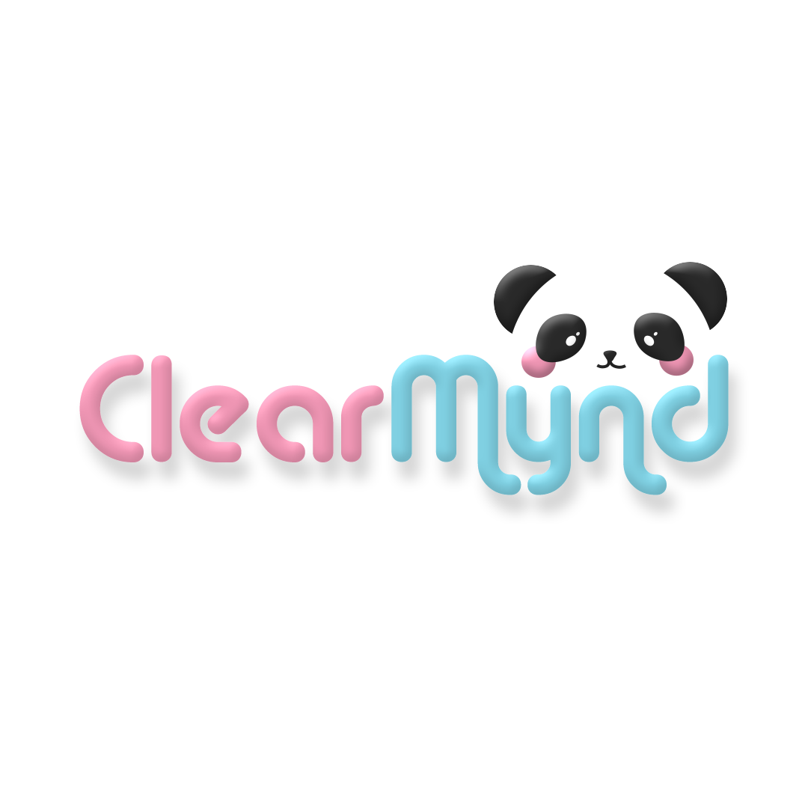
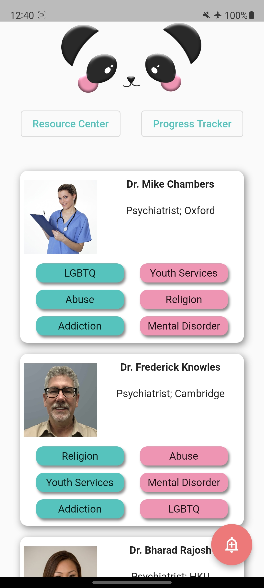
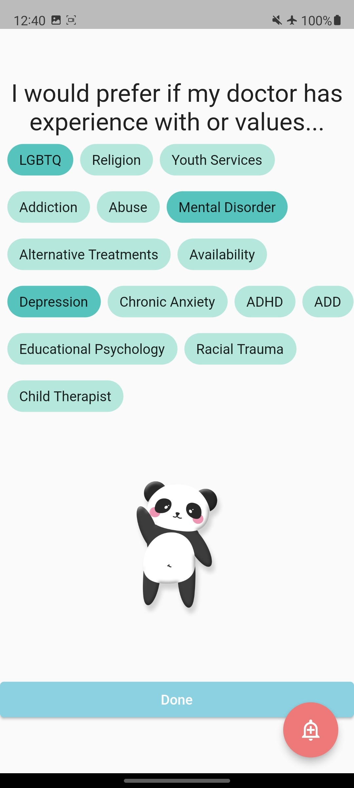
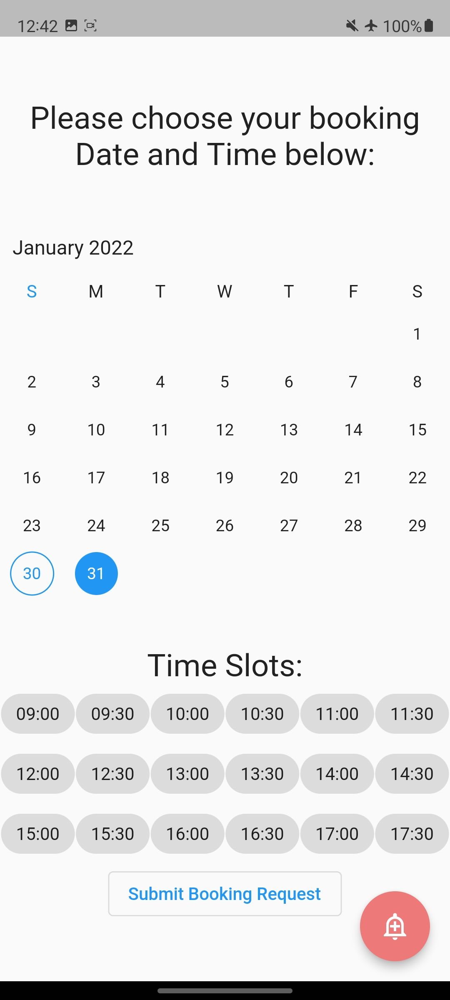

# CityHack22 Project Submission

## Project: < ClearMynd >

## Team: Dinky Dong Department

## Members

-   Milind Sharma (Leader)
-   Matthew Chamberlin
-   Matthew Betty
-   Michael Kurzewski
-   Alexander Scriba

## Description of the Project (300 words)

ClearMynd is a Platform as a Service which helps individuals seek Mental Health support. This is done by targeting a few significant pain points. The first one being that Mental Health help in Hong Kong is inaccessible. Furthermore, there is a lack of good and easy to access information for people to access the relevant medical professionals. Furthermore, there is a lack of trust and fear when it comes to Mental Health treatment. This platform allows doctors to list themselves and include a personalized profile that communicates who they are, thus giving users more of an understanding of who they are approaching. Furthermore, users can put in their preferences which will then play into our recommender algorithm and give them the best choices possible. This all solves the fundamental problem of making Mental healthcare more accessible for everyone

## 3 Most Impactful Features of the Project (with Screenshot and Short Description (150 words))

1. Dynamic Recommender System
   
   Individuals can input their preferences of what their ideal practitioner is like so that they are more comfortable with the experience. These preferences will then be used to tailor the choices of the user, this recommender system will also show them what is compatible and not compatible about a specific practitioner. This increases transparency and comfort for the user, while increasing ease of use. This is supposed increase visibility and as a result improve the overall trust of the system.

2. Personal Preference Profile
   
   Individuals will be able to select their preferences with a dynamic system. The system is designed to be as accessible as possible, regardless of age, medical knowledge or many other factors. It is designed in such a way to encourage as many users as possible to add their profile and as a result get the best options possible.

3. In-app booking system
   
   Once an individual has chosen a practitioner that they feel suits them, they can then make a booking through the app which would be able to connect to the practitioners in house booking system. This makes the whole process easier and less stressful for the individual who does not have to deal with the individual doctors booking system.

## Tech used (as many as required)

1. Flutter
2. Firebase Auth
3. Firebase Firestore
4. Proprietary Matching Algorithm
5. Figma
6. Premier Pro
7. After Effects
8. Photoshop

## Link

https://youtu.be/9EKYa1WKS1s
